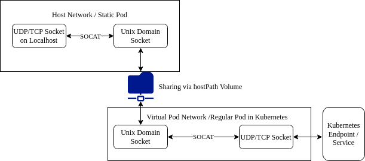

# socat-operator
Terrible idea - An operator to expose services listening on the worker node localhost into a kubernetes cluster using Unix Domain Sockets

## Design
### Initial scope
A [static pod](https://kubernetes.io/docs/tasks/configure-pod-container/static-pod/) runs [socat](http://www.dest-unreach.org/socat/) to relay a TCP/UDP socket exposed on the localhost network into a unix domain socket. The socket file is placed in a shared directory that can be used as a hostPath volume for a regular Kubernetes pod, this container can expose the unix domain socket as a TCP/UDP socket inside the cluster.
### Extension
The static pod can be extended to use a second shared volume that provides configuration data to spin up multiple socat processes for different sockets in parallel.
The configuration in this shared volume is provided by an operator running inside Kubernetes. It creates the config using a CustomResourceDefinition and spawns the necessary Kubernetes objects like DaemonSets, Services with correct labels so they appear on the right hosts.

## Purpose
The main purpose for this tool is to scrape metrics from services that are only exposed on localhost. Of course it can be used for other use cases as well, like exposing services that are difficult to migrate into containers (system loggers, auditing systems, etc.).

If [kubeadm](https://kubernetes.io/docs/reference/setup-tools/kubeadm/kubeadm/) is used to create a cluster, it creates several static pods (kube-scheduler, kube-controller-manager), that only listen on localhost by default. In order to collect metrics from those pods, one would need to expose them on the Node itself, which adds an additional risk since the service is exposed outside.

If [docker](https://github.com/docker/docker-ce) is used as a container runtime, it has the ability to expose [runtime metrics](https://docs.docker.com/config/containers/runmetrics/). Unfortunately, those metrics can't be secured via TLS from docker, so you would need to setup a reverse proxy in order to do that. If your kubernetes cluster has a ServiceMesh or similar service-to-service security, this tool would allow you to expose it and scrape it securely within your cluster.
